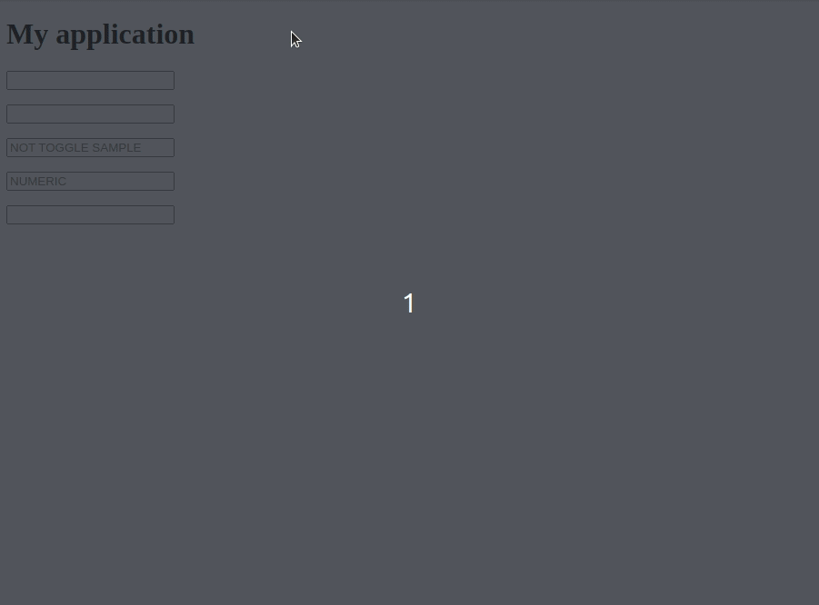

# VS Virtual Keyboard

Uma biblioteca de teclado virtual com **9kb**(com gzip) escrita em Typescript para ser utilizada em browsers
modernos.

 - Sem dependências externas
 - Totalmente customizável
 - Simples (layout querty no repositório)
 - Performatico (Vanilla typescript com VDom)
 - Sem grandes impactos em sua aplicação (baixo acoplamento)




# Instalando

Pode-se importar a função init do teclado instalando-a como um pacote npm:

```
npm install vs-virtual-keyboard --save
```


Ou usando a tag ```<script>``` com vs-virtual-keyboard.es5.js na propriedade src.
Esse arquivo pode ser encontrado no diretório dist.

```
<script src="vs-virtual-keyboard.es5.js"></script>
```

Se você deseja usar o teclado querty padrão, importe ```vs-default-keyboard.js```.
Esse arquivo está no diretório layouts.

```
import vsDefaultKeyboard from './vs-default-keyboard.js';
```


# Utilizando o plugin

Pode ser encontrado um exemplo em ```/dist/example.html```.

Tudo o que você precisa fazer é invocar a função do teclado. Depois de invocada,
todos os eventos focus in dos inputs irão fazer com que o teclado apareça. Da mesma
forma, os focus out farão com que ele desapareça.

```
VsVirtualKeyboard({

  // Keyboard wrapper class for custom css
  wrpClass: 'vs-virtual-keyboard-wrp',

  // Keyboard toggle on focus inputs types...
  availableInTypes: ['text', 'email'],

  // Keyboard layout, vs-default-keyboard.js exports a default querty
  layouts: vsDefaultKeyboard,

  // !! OPTIONAL !! Action interceptor
  interceptor(keyboardState) {
    // Auto capitalization
    if (((keyboardState.input || {}).value || '').length === 1 &&
          keyboardState.layoutName === 'uppercase-querty') {
      if (keyboardState.input.dataset.capitalized) {
        return keyboardState;
      }
      keyboardState.layoutName = 'lowercase-querty';
      keyboardState.input.dataset.capitalized = '1';
    }
    return keyboardState;
  },

  // !! OPTIONAL !! LISTENERS, receives current value and must returns new value
  // onChange, onKeyUp, onKeyDown
});


// Numeric
VsVirtualKeyboard({ availableInTypes: ['number'], layouts: vsNumericKeyboard });
```

# Criando o seu próprio layout

O parâmetro ```layouts``` da função do teclado recebe um objeto com a propriedade ```defaultLayout```.
Trata-se de uma string com o nome do layout inicial padrão.

Outra propriedade dentro de ```layouts``` é ```layouts``` (mesmo nome) que recebe um vetor de objetos.
Cada um desses objetos contém um nome (name) e um vetor de linhas (rows).

```
/**
 * NUMERIC
 * Numeric keyboard config
 */
const numericKb = [
  [...'789'],
  [...'456'],
  [...'123'],
  [
    ...'.,',
    /**
     * Backspace is a special key
     */
    (() => {
      return {
        symbol: 'backspace',
        action(value) {
          value = value+'';
          value = value.substr(0, value.length - 1);
          return value;
        }
      }
    })()
  ]
];

/**
 * Exports keyboard
 */
export default {
  defaultLayout: 'numeric',
  layouts: [ { name: 'numeric', rows: numericKb } ]
};

```

O vetor de linhas (rows) contém itens que podem ser string ou objetos. Sendo uma string,
significa que é um botão simples com o simbolo da string e imprimindo a mesma.


No caso de um objeto, pode ser definida a propriedade ```symbol```, que contém o símbolo no 
teclado. Uma imagem pode ser definida na propriedade ```base64Icon``` para simbolizar a tecla.
**Opcional**


Se a propriedade ```action``` for definida, essa ação pode ser uma função que recebe o valor
atual do input e retorna o novo valor depois de digitada a tecla. **Opcional**


Dentro desse mesmo objeto, adicionando uma string em ```layoutShift```, a chave serve para 
mudar o layout (como a tecla shift). O nome do layout a ser exibido deve ser uma string.
**Opcional**


A propriedade ```variations``` é outra opcional. Trata-se de um vetor de teclas (string ou objeto).
Essas teclas são variações da tecla atual (como o mesmo caracter, mas com acentos).
**Opcional**


