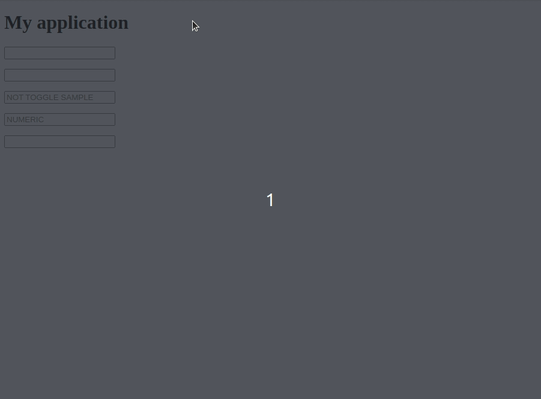
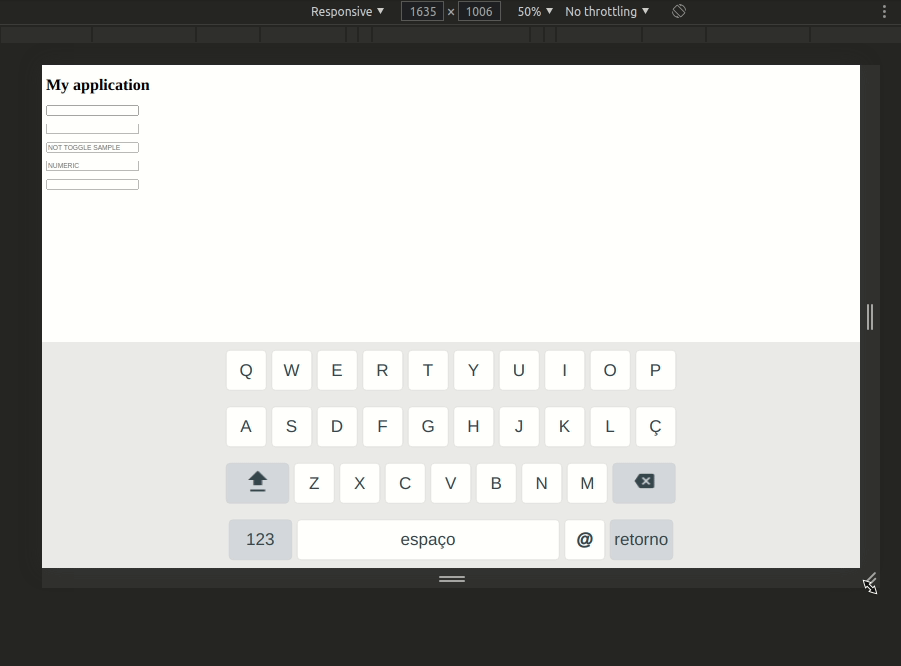

# VS Virtual Keyboard

A **9kb virtual keyboard lib**(with Gzip) written in Typescript to run on top of modern browsers.

 - No external dependencies
 - Fully customizable
 - Simple (default querty layout on repo)
 - Faster (Vanilla typescript with VDom render)
 - Almost zero application change inpact (low coupling)




# How to install

You can import the keyboard init function installing as npm package:

```
npm install vs-virtual-keyboard --save
```

Or using html ```<script>``` tag with vs-virtual-keyboard.es5 in the src property.
This file can be found on dist directory.

```
<script src="vs-virtual-keyboard.es5.js"></script>
```

If you want to use the default querty layout, you need to import the ```vs-default-keyboard.js```
file. It is on layouts directory.

```
import vsDefaultKeyboard from './vs-default-keyboard.js';
```


# How to use

There is an example file on ```/dist/example.html```.

Basically, all you need to do is invoke the keyboard function. After that, all the 
inputs focus in will toggle up the keyboard and all the focus out will toggle down
the keyboard.

```
VsVirtualKeyboard({

  // Keyboard wrapper class for custom css
  wrpClass: 'vs-virtual-keyboard-wrp',

  // Keyboard toggle on focus inputs types...
  availableInTypes: ['text', 'email'],

  // Keyboard layout, vs-default-keyboard.js exports a default querty
  layouts: vsDefaultKeyboard,

  // !! OPTIONAL !! Action interceptor
  interceptor(keyboardState) {
    // Auto capitalization
    if (((keyboardState.input || {}).value || '').length === 1 &&
          keyboardState.layoutName === 'uppercase-querty') {
      if (keyboardState.input.dataset.capitalized) {
        return keyboardState;
      }
      keyboardState.layoutName = 'lowercase-querty';
      keyboardState.input.dataset.capitalized = '1';
    }
    return keyboardState;
  },

  // !! OPTIONAL !! LISTENERS, receives current value and must returns new value
  // onChange, onKeyUp, onKeyDown
});


// Numeric
VsVirtualKeyboard({ availableInTypes: ['number'], layouts: vsNumericKeyboard });
```

# Creating your own layout

The ```layouts``` parameter of keyboard function receives on object with ```defaultLayout``` prop.
It is a string name of the default layout. 

The other prop name is ```layouts``` and receives an
array of objects. Each on of these objects haves one name and one array of rows as below.

```
/**
 * NUMERIC
 * Numeric keyboard config
 */
const numericKb = [
  [...'789'],
  [...'456'],
  [...'123'],
  [
    ...'.,',
    /**
     * Backspace is a special key
     */
    (() => {
      return {
        symbol: 'backspace',
        action(value) {
          value = value+'';
          value = value.substr(0, value.length - 1);
          return value;
        }
      }
    })()
  ]
];

/**
 * Exports keyboard
 */
export default {
  defaultLayout: 'numeric',
  layouts: [ { name: 'numeric', rows: numericKb } ]
};

```

The rows array items can be one string or one object. Being on string means one simple key
with string symbol typing the same one.


If it is an object, a symbol can be defined on ```symbol``` property. An image can be defined
on ```base64Icon``` prop.  **Its optional.**

If the property ```action``` is defined, this action will be a function receiving the current
value and returning the new value when the key is typed. **Its optional.**


Adding a string on ```layoutShift``` property, the key will shift the keyboard layout when
typed. The string layout name needs to be there. **Its optional.**


The property ```variations``` is another optional one. It is an array of keys (string or object)
that contains variations of the current key (like latin accents). **Its optional.**


